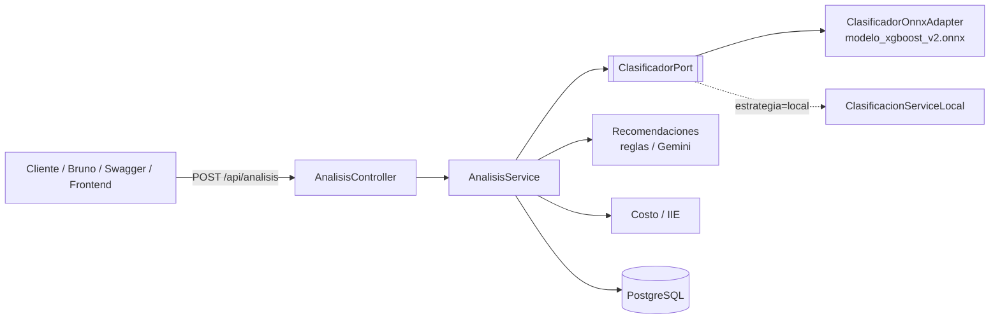

<p align="center">
  
</p>

<p align="center">
  <strong>API REST de eficiencia energética</strong><br/>
  Clasificación ONNX · costo estimado · recomendaciones con Gemini<br/>
  <sub>Tipografía de marca: <a href="https://fonts.google.com/specimen/Poppins">Poppins</a></sub>
</p>

<p align="center">
  
  
  
  
  
</p>

Backend del proyecto **EnergiAI** (Hackathon ONE G9 — Alura + Oracle). Analiza el consumo eléctrico de un inmueble, clasifica el perfil (**Eficiente / Moderado / Ineficiente**), estima el costo mensual y genera recomendaciones.

> API operativa con **ONNX Runtime**, **JWT**, historial en PostgreSQL, **modo invitado**, OAuth2 (Google/Facebook) y recomendaciones **híbridas** (reglas + Gemini).

## Contenido

- [Cómo interactuar](#cómo-interactuar)
- [Endpoints](#endpoints)
- [Contrato de factura](#contrato-de-factura)
- [Casos de prueba QA](#casos-de-prueba-qa)
- [Arquitectura](#arquitectura)
- [Recomendaciones (Gemini)](#recomendaciones-gemini)
- [Costos: invitado vs historial](#costos-invitado-vs-historial)
- [Cómo correr](#cómo-correr)
- [Perfiles y migraciones](#perfiles-y-migraciones)
- [Despliegue OCI](#despliegue-oci)

## Cómo interactuar

Hay varias formas de hablar con la API; todas usan el **mismo JSON snake_case**.

| Modalidad | Para qué | Cómo |
|---|---|---|
| **Swagger UI** | Explorar el contrato, *Try it out*, Authorize JWT | [Local](http://localhost:8080/swagger-ui.html) · [OCI](http://146.181.33.44:8080/swagger-ui.html) · spec [`/v3/api-docs`](http://localhost:8080/v3/api-docs) |
| **Bruno** | Colección versionada (invitado, JWT, OAuth, ONNX, historial) | Abrir la carpeta [`bruno/`](bruno/) con *Open Collection* |
| **curl / HTTP** | Scripts, CI, smoke | `POST /api/analisis` con `Content-Type: application/json` |
| **Invitado** | Demo sin cuenta; **no** persiste | Sin header `Authorization`, `"guardar": false` |
| **JWT** (registro / login) | Historial + bloque `costos` + recomendaciones matizadas | `Authorization: Bearer <jwt>` |
| **OAuth Google / Facebook** | Canje de token social → JWT propio | `POST /api/auth/oauth/google` o `/facebook` |
| **Frontend** | Formulario del prototipo contra esta API | Mismo body que Bruno / Swagger |

En Swagger: **Authorize** → pegar el JWT (el esquema ya es `Bearer`). Guía paso a paso: [`docs/GUIA_POSTMAN_BRUNO.md`](docs/GUIA_POSTMAN_BRUNO.md).

```bash
# Invitado (sin JWT)
curl -s -X POST http://localhost:8080/api/analisis \
  -H 'Content-Type: application/json' \
  -d '{
    "factura": {
      "consumo_mensual": 320,
      "uso_horario_pico": "no",
      "cantidad_equipos": 3,
      "tipo_inmueble": "Departamento",
      "horas_alto_consumo": 1.0,
      "month": 4
    },
    "guardar": false
  }'
```

## Endpoints

| Método | Ruta | Auth | Descripción |
|---|---|---|---|
| POST | `/api/analisis` | No (invitado) | Clasificación + negocio. `guardar=true` exige JWT |
| GET | `/api/historial` | JWT | Historial del usuario autenticado |
| GET | `/api/historial/{id}` | JWT | Detalle de un análisis propio |
| POST | `/api/auth/registro` | No | Alta (email + password ≥ 8) → JWT |
| POST | `/api/auth/login` | No | Login → JWT |
| POST | `/api/auth/oauth/google` | No | Canje Google `id_token` → JWT |
| POST | `/api/auth/oauth/facebook` | No | Canje Facebook `access_token` → JWT |
| GET | `/oauth2/authorization/{google\|facebook}` | No | Login browser si `APP_OAUTH2_ENABLED=true` |
| POST | `/api/pruebas/onnx` | No | Inferencia xgboost-v2 aislada (sin costo ni persistencia) |
| POST | `/api/pruebas/onnx-rf` | No | Legacy RF (pruebas) |
| GET | `/swagger-ui.html` | No | Documentación interactiva |
| GET | `/v3/api-docs` | No | Spec OpenAPI 3 (JSON) |

## Contrato de factura

Campos **obligatorios** (alineados al dataset / tensor ONNX). `consumo_mensual` es de negocio: **no** entra al tensor.

| Campo JSON | Tipo | Rango / valores |
|---|---|---|
| `consumo_mensual` | integer | **80–1200** kWh (entero JSON, sin `1E3`) |
| `uso_horario_pico` | string | exactamente `"si"` \| `"no"` |
| `cantidad_equipos` | integer | 0–50 |
| `tipo_inmueble` | string | `Casa` \| `Departamento` \| `Monoambiente` (case-insensitive) |
| `horas_alto_consumo` | number | 0.0–24.0 |
| `month` | int o string | 1–12 o nombre del mes (`enero`…`diciembre`) |

Opcionales: `numero_personas`, `tiene_aire_acondicionado`, `tiene_calentador`, `tiene_iluminacion_led` (booleanos JSON), `antiguedad_electrodomesticos`, `tarifa_electrica`. `estacion_anio` es legado: la estación de negocio se infiere desde `month` (calendario británico: ene–mar invierno, abr–jun primavera, jul–sep verano, oct–dic otoño).

El tensor (`metadata_backend.json`) es **22 floats**: one-hot de tipo (3) + month (12) + pico `[no, si]` (2) + horas + equipos + 3 sintéticas (`intensidad_por_equipo`, `horas_pico_interaccion`, `desviacion_equipos_tipo`). La respuesta incluye `consulta_modelo`, `features_sinteticas` y `vector_onnx`.

Detalle del encoding: [`docs/json-campos-rangos.md`](docs/json-campos-rangos.md).

### Errores 400

Los errores de **dominio** (rangos, allowlists) se acumulan: `message` resume cuántos campos fallaron y `fieldErrors` detalla cada uno en snake_case, con el valor recibido. Los de **tipo/formato** (string donde va un entero, notación científica, `"true"` en un boolean) cortan la lectura del JSON y se reportan de a uno.

## Casos de prueba QA

Un mismo set de **5 perfiles**, reutilizado en notebook (ONNX vs joblib), API y plataforma. En Swagger aparecen como ejemplos **QA1…QA5** de `POST /api/analisis`.

| # | Nombre | tipo | month | pico | horas | equipos | consumo | Esperado |
|---|---|---|---|---|---|---|---|---|
| 1 | Eficiente claro | Departamento | 4 | no | 1.0 | 3 | 320 | 200, **Eficiente** |
| 2 | Ineficiente claro | Casa | 7 | si | 10.0 | 22 | 320 | 200, **Ineficiente** |
| 3 | Frontera | Casa | 8 | si | 5.5 | 10 | 420 | 200, ~50% Moderado / ~50% Ineficiente |
| 4 | Límite válido | Departamento | 1 | no | 0.0 | 0 | 80 | 200, Eficiente; sin NaN |
| 5 | Inválido | `"Oficina"` | 13 | si | 30.0 | 8 | 320 | **400** con `fieldErrors` (no clasifica) |

### Caso 3 (Frontera) — JSON completo

```json
{
  "factura": {
    "consumo_mensual": 420,
    "uso_horario_pico": "si",
    "cantidad_equipos": 10,
    "tipo_inmueble": "Casa",
    "horas_alto_consumo": 5.5,
    "month": 8,
    "numero_personas": 4,
    "tiene_aire_acondicionado": true,
    "tiene_calentador": false,
    "tiene_iluminacion_led": true,
    "antiguedad_electrodomesticos": "menor a 10 años",
    "tarifa_electrica": 0.85
  },
  "guardar": false
}
```

Este caso produce probabilidades cercanas al 50% para Moderado e Ineficiente, demostrando el comportamiento en la frontera de decisión del modelo.

El caso 5 cubre validación, no el modelo: `tipo_inmueble`, `month` y `horas_alto_consumo` fallan juntos.

## Arquitectura

El backend clasifica con **ONNX Runtime Java** (`modelo_xgboost_v2.onnx`, 3 clases). `modelo_xgboost.onnx` (v1) y `version2.0.onnx` (RF 6 features) quedan como legacy (`APP_MODELO_ONNX_RUTA` / `APP_MODELO_ONNX_VERSION`).

1. El cliente envía `POST /api/analisis` con la factura (y opcionalmente un `resultado` ya calculado).
2. Si no viene `resultado`, `ClasificadorOnnxAdapter` arma el vector de 22 features y ejecuta el ONNX.
3. El backend calcula negocio (costo, IIE, recomendaciones) y **persiste** si `guardar=true` + JWT.
4. Alternativa: `APP_MODELO_ESTRATEGIA=local` usa softmax sobre `modelo_energiai.json`.



### Stack

Java 21 · Spring Boot 3.3 · Validation · Data JPA · Security · PostgreSQL 16 · JWT (jjwt 0.12) · springdoc-openapi · ONNX Runtime 1.28 · Maven · Docker (multiarch amd64/arm64 para la VM A1.Flex de OCI).

## Recomendaciones (Gemini)

`APP_RECOMENDACIONES_MODO` (default `hibrido`):

| Modo | Comportamiento |
|---|---|
| `reglas` | Set cerrado, determinístico |
| `hibrido` | Las reglas eligen temas; Gemini reformula la frase patrón |
| `gemini` | Reformula el mismo set; si falta `GEMINI_API_KEY` o hay timeout, **fallback a reglas** |

El prompt envía contexto factual (categoría, tipo, month, pico, horas, equipos, consumo). Con JWT también cita cifras de `costos` e `historial_resumen`. Modelo default: `gemini-2.5-flash-lite`.

## Costos: invitado vs historial

`costo_estimado_mensual` es siempre `consumo_mensual × tarifa`, igual para invitado y registrado.

Con **JWT válido** la respuesta agrega:

- `costos` — recargo por estacionalidad + recargos accionables (horario pico, sin LED, equipos > 5 años), costo ajustado, ahorro potencial, proyección de las 4 estaciones y `benchmark` de consumo.
- `historial_resumen` — promedios previos, variación de consumo/costo y comparativa contra la misma estación.

Parámetros en `src/main/resources/model/parametros_costos.json` (`APP_COSTOS_RUTA`). Umbrales default: hoja `metricas_final`. Rollback sin recompilar:

```bash
export APP_COSTOS_UMBRALES=parametros
```

Eso solo cambia `costos.benchmark`. Detalle: [`docs/costos-estacionales.md`](docs/costos-estacionales.md).

## Cómo correr

Requiere **JDK 21**.

### Docker (app + PostgreSQL)

```bash
cp .env.example .env   # completar credenciales y, si aplica, GEMINI_API_KEY
docker compose up --build
# API:     http://localhost:8080
# Swagger: http://localhost:8080/swagger-ui.html
```

### Maven (contra la BD remota en OCI)

```bash
export SPRING_DATASOURCE_PASSWORD='...'   # no versionar secretos
mvn spring-boot:run -Dspring-boot.run.profiles=dev
```

### Tests (H2 en memoria, sin PostgreSQL)

```bash
mvn test
```

## Perfiles y migraciones

| Perfil | BD | `ddl-auto` | Uso |
|---|---|---|---|
| `dev` | PostgreSQL remoto (OCI) | `none` (Flyway) | Desarrollo |
| `prod` | PostgreSQL local (VM / Compose) | `none` (Flyway) | Producción |
| `test` | H2 en memoria | `create-drop` | Tests |

Flyway es dueño del esquema (`src/main/resources/db/migration/`):

- `V1` esquema inicial · `V2` variables de factura · `V3` mes · `V4` features sintéticas xgboost · `V5` costos estacionales · `V6-V8` ajustes menores · `V9` campo año en factura · `V10` limpieza de duplicados · `V11` corrección de años históricos.
- Config: `baseline-on-migrate=true`, `baseline-version=0`.
- Cambio nuevo: agregar `V12__…sql` (no editar un script ya aplicado).

## Despliegue OCI

```bash
./scripts/deploy-oci.sh
# ENERGIAI_SSH_USER=opc ENERGIAI_SSH_KEY=/ruta/a/key ./scripts/deploy-oci.sh
# ENERGIAI_HEAP_MB=256 ./scripts/deploy-oci.sh
```

Solo empaquetar: `./scripts/package-snapshot.sh`. En la VM de ~1 GiB: `sudo bash scripts/tune-oci-vm.sh --status` (protege Postgres nativo; no quita Docker si la BD sigue en contenedor).

## Seguridad

- **Invitado:** `POST /api/analisis` con `guardar=false` (sin JWT).
- **Registro / login / OAuth:** emiten JWT. Historial solo con `Authorization: Bearer <jwt>`.
- **OAuth browser:** `APP_OAUTH2_ENABLED=true` + client id/secret. El canje API (`/api/auth/oauth/*`) está siempre disponible.

### Frontend SPA

El frontend en `/static/` maneja autenticación sin salir de la aplicación:

1. **OAuth Google:** `/oauth2/authorization/google` → Google → `/oauth-callback.html#token=...` → `localStorage`
2. **Login local:** `POST /api/auth/login` → JWT en response → `localStorage`
3. **Llamadas API:** `Authorization: Bearer <jwt>` desde `localStorage`

Detalle del flujo: [`docs/flujo-autenticacion-spa.md`](docs/flujo-autenticacion-spa.md).

Variables de entorno de referencia: [`.env.example`](.env.example).


### Para ver Frontend al 21/08/2026:

- **En despliegue funcional:** https://energi-ai.netlify.app
- **Repo GitHub:** https://github.com/danielsantiagoroca/frontend-energiai
