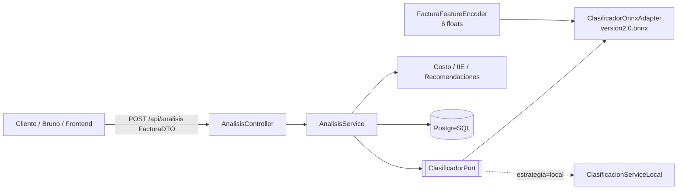

# EnergiAI API

Backend del proyecto **EnergiAI** (Hackathon ONE G9 - Alura + Oracle): analiza el
consumo eléctrico de un inmueble, clasifica el perfil de eficiencia
(**Eficiente / Moderado / Ineficiente**), estima el costo mensual y genera
recomendaciones, exponiendo todo vía API REST.

> Estado: **esqueleto**. Las clases y contratos están definidos; la lógica de
> negocio fina (recomendaciones avanzadas, OAuth2, endurecimiento de seguridad)
> se completa en las siguientes iteraciones.

## Stack

- Java 21, Spring Boot 3.3
- Spring Web, Validation, Data JPA, Security (+ OAuth2 client listo)
- PostgreSQL 16 (driver `org.postgresql`)
- JWT (jjwt 0.12.x)
- springdoc-openapi (Swagger UI)
- Maven · Docker (imágenes multiarch amd64/arm64 para la VM A1.Flex de OCI)

## Decisión de arquitectura: inferencia con `version2.0.onnx`

El backend clasifica con **ONNX Runtime Java** (`version2.0.onnx`, Random Forest).
El contrato HTTP sigue siendo el de la **Factura** (5 obligatorios + 7 opcionales).

1. El cliente envía `POST /api/analisis` con la factura (y opcionalmente un `resultado` ya calculado).
2. Si no viene `resultado`, `ClasificadorOnnxAdapter` codifica **6 features** y ejecuta el ONNX.
3. El backend calcula **negocio** (costo, índice, recomendaciones) y **persiste** si `guardar=true` + JWT.
4. Alternativa: `app.modelo.estrategia=local` usa softmax sobre `modelo_energiai.json`.



### Encoding interno → ONNX (`float_input` [1,6])

| Índice | Feature | Origen en Factura |
|---|---|---|
| 0 | consumoMensual | obligatorio |
| 1 | usoHorarioPico (0/1) | obligatorio |
| 2 | cantidadEquipos | obligatorio |
| 3 | tipoInmueble enc | **obligatorio** (monoambiente=0, departamento=1, casa=2; no se imputa) |
| 4 | horasPromedioUso | obligatorio |
| 5 | estacionAnio enc | primavera=0 … invierno=3 (imputable) |

Salida del modelo: `output_label` (`eficiente`/`moderado`/`ineficiente`) + `output_probability` (ZipMap).

## Árbol de clases (qué programar / extender)

```
com.energiai.energiaiapi
├── EnergiaiApiApplication
├── config
│   ├── SecurityConfig         # permitAll ahora; endurecer con JWT/OAuth2 luego
│   ├── CorsConfig
│   └── OpenApiConfig
├── controller
│   ├── AnalisisController     # POST /api/analisis
│   ├── HistorialController    # GET  /api/historial   (requiere JWT)
│   └── AuthController         # POST /api/auth/registro | /api/auth/login
├── dto
│   ├── FacturaDTO             # 5 obligatorios + 7 opcionales (Bean Validation)
│   ├── ResultadoModeloDTO     # clasificación que envía el frontend (ONNX)
│   ├── AnalisisRequest / AnalisisResponse
│   ├── HistorialItemResponse
│   ├── RegistroRequest / LoginRequest / AuthResponse
│   └── ErrorResponse
├── domain
│   ├── Usuario / Factura / Analisis         # entidades JPA
│   └── enums (CategoriaEficiencia, AuthProvider)
├── repository
│   ├── UsuarioRepository
│   └── AnalisisRepository
├── service
│   ├── AnalisisService        # orquesta clasificación + negocio + persistencia
│   ├── CostoService           # costo mensual + índice IIE
│   ├── RecomendacionService   # reglas de recomendación
│   ├── HistorialService
│   ├── UsuarioService         # registro/login + UserDetailsService
│   └── inference
│       ├── ClasificadorPort           # puerto (estrategia de inferencia)
│       ├── ClasificacionServiceLocal  # fallback softmax en Java
│       └── ModeloParametros           # carga modelo_energiai.json
├── security
│   ├── JwtService
│   └── JwtAuthenticationFilter         # no bloqueante: puebla contexto si hay token
└── exception
    ├── GlobalExceptionHandler
    ├── RecursoNoEncontradoException
    └── ReglaNegocioException
```

## Endpoints

| Método | Ruta | Auth | Descripción |
|---|---|---|---|
| POST | `/api/analisis` | Opcional | Analiza una factura. Guarda si `guardar=true` y hay sesión |
| GET | `/api/historial` | JWT | Historial del usuario autenticado |
| POST | `/api/auth/registro` | No | Registro (email + password) → JWT |
| POST | `/api/auth/login` | No | Login → JWT |
| GET | `/swagger-ui.html` | No | Documentación interactiva |

### Ejemplo `POST /api/analisis`

```json
{
  "factura": {
    "consumoMensual": 320.5,
    "usoHorarioPico": true,
    "cantidadEquipos": 8,
    "tipoInmueble": "casa",
    "horasPromedioUso": 4.5,
    "estacionAnio": "verano",
    "numeroPersonas": 4,
    "tieneAireAcondicionado": true,
    "tieneCalentador": false,
    "tieneIluminacionLed": false,
    "antiguedadElectrodomesticos": "menor a 5 años",
    "tarifaElectrica": 0.75
  },
  "resultado": {
    "categoria": "Moderado",
    "probabilidades": {"Eficiente": 0.3, "Moderado": 0.5, "Ineficiente": 0.2}
  },
  "guardar": false
}
```

Valores categoricos permitidos:
- `tipoInmueble`: `monoambiente` | `departamento` | `casa`
- `estacionAnio`: `primavera` | `verano` | `otoño` | `invierno`
- `antiguedadElectrodomesticos`: `menor a 3 años` | `menor a 5 años` | `menor a 10 años` | `mayor a 10 años`

## Cómo correr

### Local con Docker (app + PostgreSQL)

```bash
cp .env.example .env   # completar credenciales
docker compose up --build
# API:     http://localhost:8080
# Swagger: http://localhost:8080/swagger-ui.html
```

### Local con Maven (contra la BD dev remota en OCI)

```bash
export SPRING_DATASOURCE_PASSWORD='...'   # ver BD_DATOS.txt (no versionar)
mvn spring-boot:run -Dspring-boot.run.profiles=dev
```

> Requiere **JDK 21**. La VM de OCI ya lo instala (`setup_vm.sh`).

### Tests (usa H2, no requiere PostgreSQL)

```bash
mvn test
```

## Perfiles

| Perfil | BD | `ddl-auto` | Uso |
|---|---|---|---|
| `dev` | PostgreSQL remoto (OCI `146.181.33.44`) | `update` | Desarrollo |
| `prod` | PostgreSQL local (VM) | `validate` | Producción en la VM |
| `test` | H2 en memoria | `create-drop` | Tests |

## Migraciones (Flyway)

Flyway es el **dueño del esquema** (Hibernate corre con `ddl-auto: none`), lo que da
trazabilidad completa desde el arranque: cada cambio de BD es un script versionado en
`src/main/resources/db/migration/` y queda registrado en la tabla `flyway_schema_history`.

- `V1__init_schema.sql`: crea `usuario`, `factura`, `analisis`, `analisis_recomendacion`.
- `V2__actualizar_variables_factura.sql`: actualiza columnas de `factura` (consumo float,
  estacion del año, horas promedio, calentador).
- Config: `baseline-on-migrate=true`, `baseline-version=0`.
- Para un cambio nuevo: agregar `V3__descripcion.sql` (nunca editar un script ya aplicado).

## Pendiente (próximas iteraciones)

- Endurecer `SecurityConfig` (exigir JWT en `/api/historial`).
- Activar OAuth2 (Google/Facebook) — dependencia ya incluida.
- Cargar los coeficientes reales del modelo cuando Ciencia de Datos los entregue.
